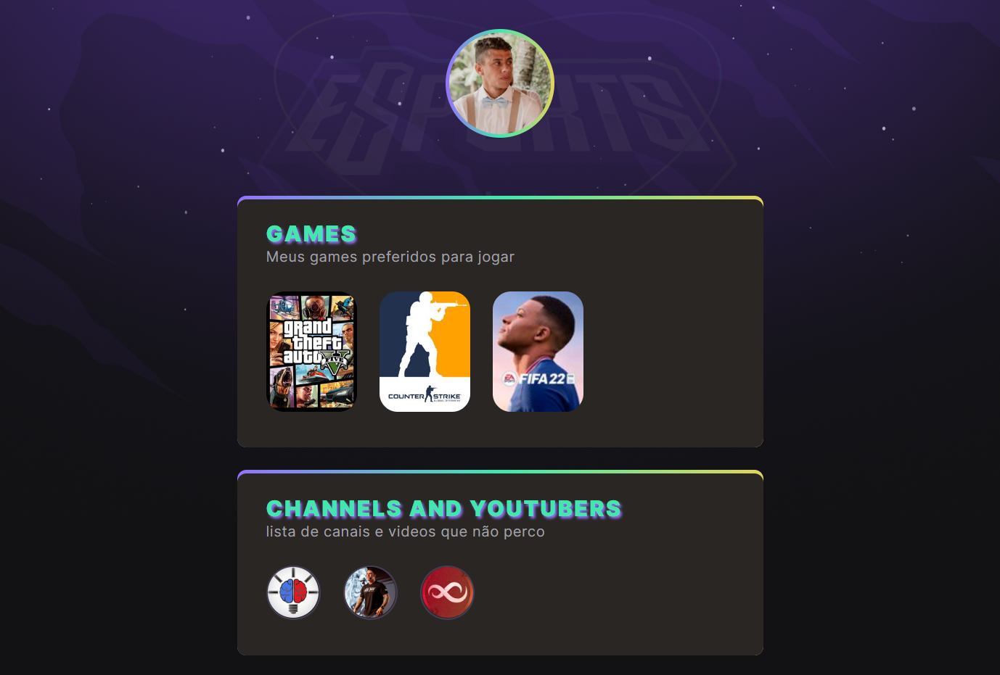

# NLW eSports

> Trilha Explorer

Projeto construído do evento Next Level Week da Rocketseat.

[Clique aqui para acessar o projeto](https://viniferreiraa.github.io/NLW-eSports-explorer)

## Desafios
- Estruturar o visual da página com HTML (Hipertext Markup Language) ;
- Desenvolver o visual da página com CSS (Cascading Style Sheets) ;
- Subir o projeto com Versionamento de Código (Github/Git)

## Tecnologias

- HTML
- CSS
- Git e Github

## Contato

https://www.linkedin.com/in/marcos-vinicius-ferreira-de-oliveira/
